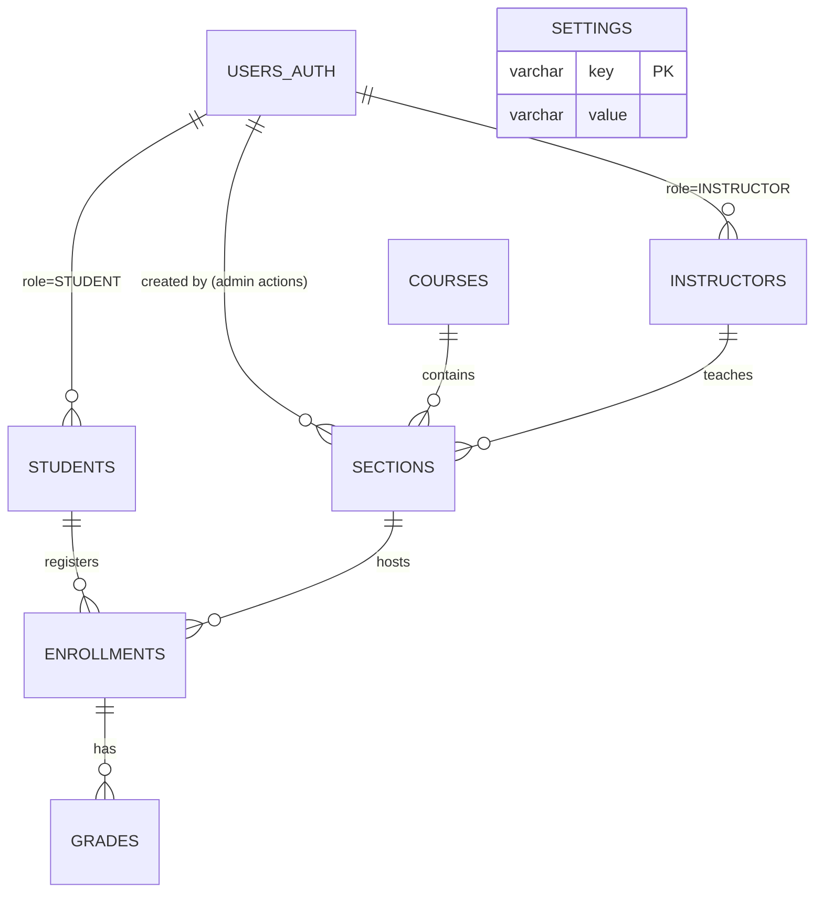
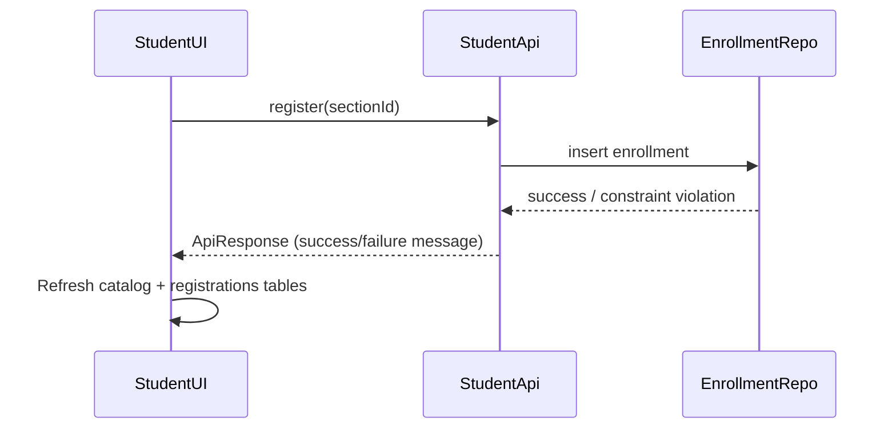
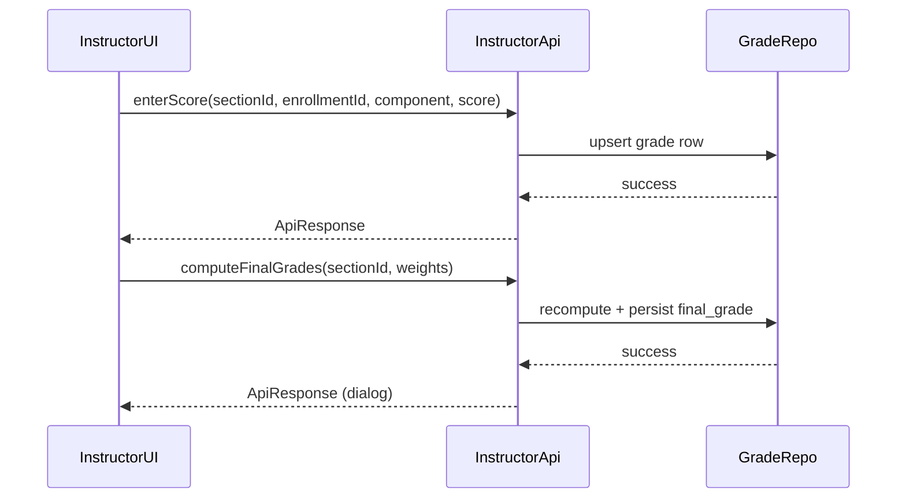
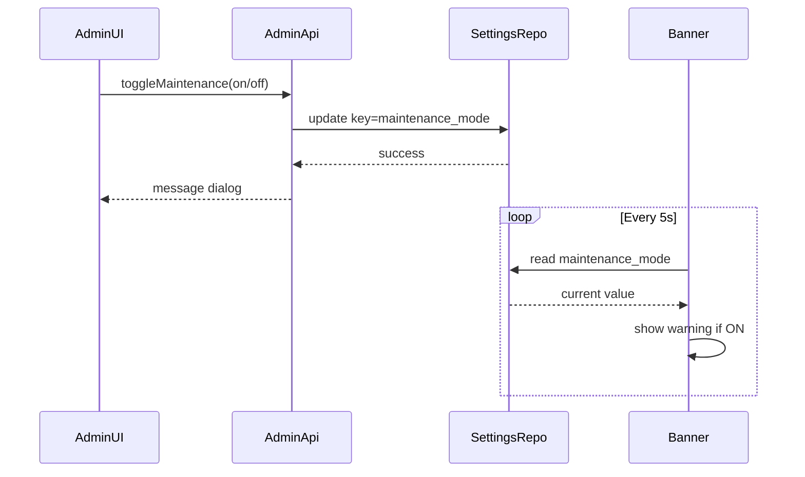

# Diagrams & Sketches

> Use these textual/mermaid diagrams as placeholders if you need to generate PDFs later. Replace with hand-drawn/Visio equivalents if preferred.

---

## 1. Use-Case Lists

### Admin
- Manage users (create student/instructor/admin accounts).
- Manage courses and sections (CRUD + instructor assignment).
- Toggle maintenance mode; trigger DB backup/restore.
- Change own password, log out.

### Instructor
- View assigned sections.
- Enter component scores (QUIZ/MIDTERM/END_SEM).
- Compute final grades; export grades.
- View class statistics.
- Change password / log out.

### Student
- Browse course catalog, register/drop sections.
- View timetable and grades.
- Export transcript (CSV/PDF).
- Change password / log out.

---

## 2. “Things” Sketch (Entities & Relations)

> The ERD covers both `univ_auth` (users_auth) and `univ_erp` schemas. Settings acts as a global config table (maintenance mode).

---

## 3. Flow Sketches

### 3.1 Student Enrollment Flow

### 3.2 Instructor Grade Entry Flow

### 3.3 Maintenance Toggle Flow

---

These diagrams satisfy the “use-case lists,” “things sketch,” and “2–3 flow sketches” requirements. Adjust labels or add screenshots before final submission if needed. 

